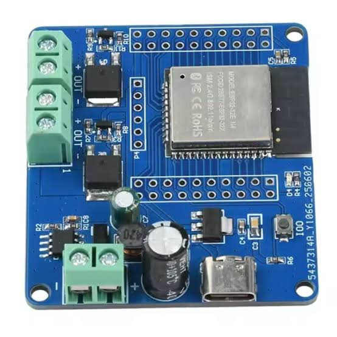

# esp-chicken-clock

## Introduction

Chickens go to roost as the light fades and want to be let out as the sun rises. However they are not like clockwork, so a camera is used to observe them. However to solar charged batter has limited life so a ESP32_MOS_X2_V1.1 board is used to switch power to the camera on and off at the right time.

## Function

Switch on the camera a configurable number of minutes before sun set.

## Platform

A commonly available board, ESP32_MOS_X2_V1.1 has an ESP32-32E N4 and a two channel MOSFET solid state "switch".

## GPIO pin assignments

GPIO16, GPIO17, (GPIO26, and GPIO27)

LED: GPIO23

## Sunset schedule

The Settings page stores a map-selected latitude and longitude plus signed
minute offsets for sunset and dusk in NVS. When station Wi-Fi and NTP time are
available, the firmware requests that location's sunset and dusk as UTC Unix
timestamps from `sunrise-sunset.org`. This avoids applying the browser's time
zone or daylight-saving rules to the switching calculation.

MOSFET 1 is driven high from `sunset + sunset offset` until `dusk + dusk
offset`. The shared page header shows the FET state and the next sunset/dusk
event, rounded to the nearest minute. Browser-local time is only a display
preference; it does not affect the switching window.

## TODO

### Remaining

* [ ] Add an override button to home page to switch between on/off/timer mode.
* [ ] The AP provides the "capture" feature to redirect android/iphone and windows devices to the web site.
* [ ] Add button to web site to obtain time/date from browser.
* [ ] In website have ability to configure the four setting of minutes before/after rise/set.
* [ ] Enter a low power mode when the timer can be off. Sleep for 5minutes, wake and then go to sleep again.
* [ ] Add a configurable sunrise window as well as the implemented sunset-to-dusk window.
* [ ] Add NVS-backed cache of sun events to survive power loss, network outage, or NTP failure.

### Completed

* [x] Add web site. This does not need to be secure.
* [x] Web site includes configuration for an existing Wi-Fi SSID/password.
* [x] Try to log into the existing Wi-Fi.
* [x] If unable to connect to existing Wi-Fi after 10 seconds, become an AP.
* [x] After one minute without setup-AP activity, retry saved Wi-Fi credentials.
* [x] AP configuration is fixed and protected with a fixed password.
* [x] Have a hard-wired, non-configurable list of network time servers.
* [x] When connected to existing Wi-Fi, contact network time servers for the time.
* [x] Document a strategy for obtaining sunrise/sunset from the internet.
* [x] Add a web page to set location coordinates for sun events.
* [x] Store Wi-Fi credentials, location, and offsets across power loss using NVS.
* [x] Turn MOSFET 1 on at sunset plus its offset and off at dusk plus its offset.
* [x] Keep scheduling in UTC so browser time zones and daylight saving do not affect switching.
